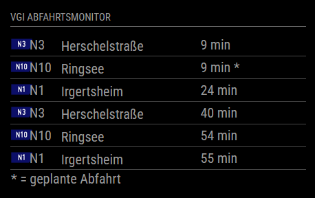

# MMM-VGIWiesty [](https://github.com/wiesty/MMM-VGIWiesty/raw/master/LICENSE) 

MagicMirror² Module to display public transport from Ingolstadt in Germany.





## Dependencies
* instance of [MagicMirror²](https://github.com/MichMich/MagicMirror)

## Installation
1. Clone this repository in your MagicMirror installation into the folder modules.
```git clone https://github.com/wiesty/MMM-VGIWiesty.git```
2. Install dependencies in main MagicMirror folder
3. Search your station and modify the config template below
4. Add configuration to your config.js

## Config

```
{
    module: "MMM-VGIWiesty",
    position: "top_left",
    config: {
        maxEntries: 5,               // Maximum number of departures to display
        station: "IN-ZOB",           // Station name
        overwriteIP: false,          // Use a custom URL and port if needed
        customURL: "",               // Custom base URL for CORS, if overwriteIP is true
        customPort: ""               // Custom port for CORS, if overwriteIP is true
    }
}
```

### Configuration Options

-   **maxEntries**: The maximum number of departures to display on the screen.
-   **station**: The name of the station in Ingolstadt (e.g., "IN-ZOB").
-   **overwriteIP**: Boolean that allows custom URL and port for API requests.
-   **customURL**: The URL to use if `overwriteIP` is `true`.
-   **customPort**: The port to use if `overwriteIP` is `true`.

#

### Displaying Planned Departures

If `realtime` is `false` for a departure, a `*` will appear next to the time, indicating a planned (not real-time) departure. The table footer clarifies this with `* = geplante Abfahrt`.

## Changelog

### v1.0.0 - Latest Release

-   **New Config Option**: `overwriteIP`, `customURL`, and `customPort` - Allows configuration of custom IP and port settings for CORS handling.
-   **Updated Display**: Footer row added to clarify the meaning of `*` as a planned departure.
-   **Initial Release**: Displays real-time departures for Ingolstadt using the VGI API, customizable to show multiple stations and routes.
